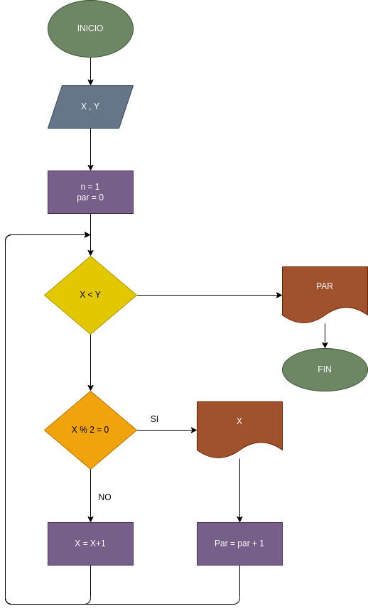

# Dado un rango de números enteros obtener la cantidad de números pares que contiene.

## Definicion de variables

#### X = Valor inicial del rango
#### Y = Valor final del rango

## Diagrama de flujo

